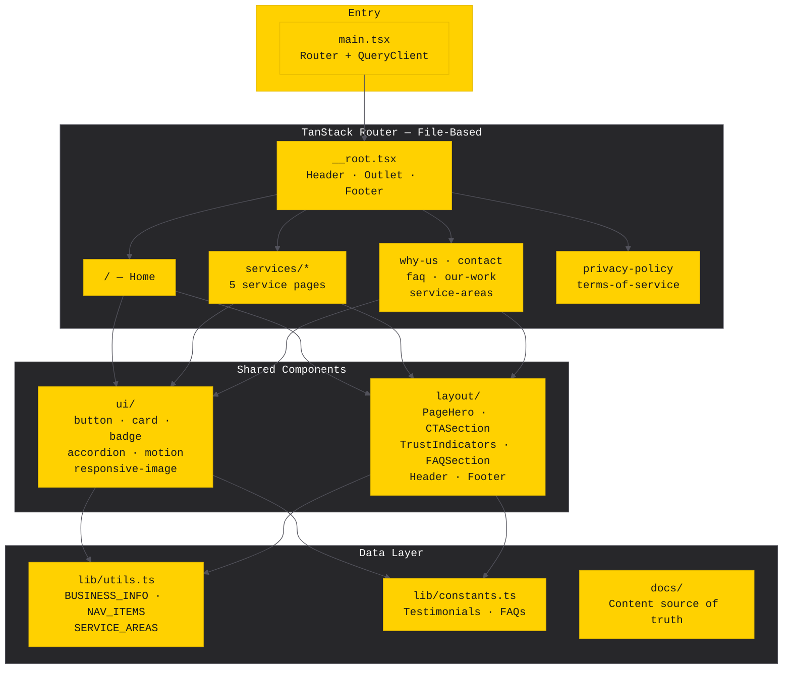

# A-Line Striping, Inc.

**Professional parking lot striping, warehouse marking & asphalt sealcoating — serving Mississippi, Memphis & the Mid-South since 2003.**

[](https://react.dev)
[](https://www.typescriptlang.org)
[](https://tailwindcss.com)
[](https://vite.dev)

---

## Architecture



## Tech Stack

| Layer             | Technology                                                        |
| ----------------- | ----------------------------------------------------------------- |
| **Framework**     | React 19 + React Compiler                                         |
| **Routing**       | TanStack Router (file-based, type-safe)                           |
| **Data**          | TanStack Query                                                    |
| **Styling**       | Tailwind CSS 4 + custom industrial design system                  |
| **UI Primitives** | Radix UI (accordion, dialog, dropdown, navigation, select, toast) |
| **Animation**     | Motion (Framer Motion)                                            |
| **Icons**         | Lucide React                                                      |
| **Validation**    | Zod 4                                                             |
| **Build**         | Vite 7 with image optimization (Sharp, SVGO)                      |
| **Language**      | TypeScript 5.9 (strict mode)                                      |

## Design System

The UI follows a **Premium Utilitarian / Industrial** direction — built for facility managers and commercial operators who value clarity over decoration.

| Token              | Purpose                                                |
| ------------------ | ------------------------------------------------------ |
| `stripe-500`       | OSHA Safety Yellow — primary accent, CTAs, focus rings |
| `electric-500`     | ADA Compliance Blue — links, secondary accent          |
| `asphalt-950 → 50` | Neutral scale — concrete to near-black                 |
| `font-display`     | Barlow Condensed — industrial uppercase headings       |
| `font-sans`        | Public Sans — USWDS-grade body text                    |

Key constraints: **0px border-radius**, **8dp spacing grid**, **hard box-shadows**, **WCAG AA+ contrast**.

All tokens live in `src/index.css` under `@theme`.

## Getting Started

```bash
# Install dependencies
yarn install

# Start dev server
yarn dev

# Build for production
yarn build

# Preview production build
yarn preview

# Lint
yarn lint

# Generate optimized images
yarn images
```

## Project Structure

```
src/
├── components/
│   ├── ui/                 # Primitives — button, card, badge, accordion, motion, responsive-image
│   └── layout/             # Compositions — Header, Footer, PageHero, CTASection, TrustIndicators, FAQSection
├── routes/                 # TanStack Router file-based routes (auto-generates routeTree.gen.ts)
│   ├── __root.tsx          # Root layout with SEO schema markup
│   ├── index.tsx           # Home
│   ├── services/           # 5 service pages (parking-lot-striping, warehouse, sealcoating, layout-design, linework-signage)
│   └── ...                 # why-us, contact, faq, our-work, service-areas, legal pages
├── lib/
│   ├── utils.ts            # Business info, nav structure, service areas, helpers
│   └── constants.ts        # Testimonials, FAQs, shared content
├── main.tsx                # App entry — router config, query client, scroll restoration
├── index.css               # Design system tokens (@theme block)
└── routeTree.gen.ts        # Auto-generated — do not edit
```

## Performance

- **Code splitting** — lazy routes + manual vendor chunks (react, router, ui)
- **Image optimization** — build-time compression via `vite-plugin-image-optimizer`, responsive `srcset` via `ResponsiveImage` component
- **Preloading** — intent-based (`defaultPreload: "intent"`) with 30s stale time
- **React Compiler** — automatic memoization targeting React 19

## Configuration

| Item               | Location                      | Action Required                                                             |
| ------------------ | ----------------------------- | --------------------------------------------------------------------------- |
| GA4 Measurement ID | `index.html`                  | Replace `G-XXXXXXXXXX` with your GA4 ID                                     |
| Web3Forms API Key  | `src/routes/contact.lazy.tsx` | Replace `YOUR_WEB3FORMS_ACCESS_KEY` ([get one free](https://web3forms.com)) |

## Sitemap

```
/                                   Home
/services/parking-lot-striping      Parking Lot Striping
/services/warehouse-floor-striping  Warehouse Floor Striping
/services/asphalt-sealcoating       Asphalt Sealcoating
/services/layout-design             Layout Design
/services/precision-linework-signage Precision Linework & Signage
/why-us                             Why Choose A-Line
/service-areas                      Service Coverage
/our-work                           Project Gallery
/faq                                Frequently Asked Questions
/contact                            Contact / Request a Quote
/privacy-policy                     Privacy Policy
/terms-of-service                   Terms of Service
```

---

<sub>A-Line Striping, Inc. · Horn Lake, MS · (901) 335-8772</sub>
